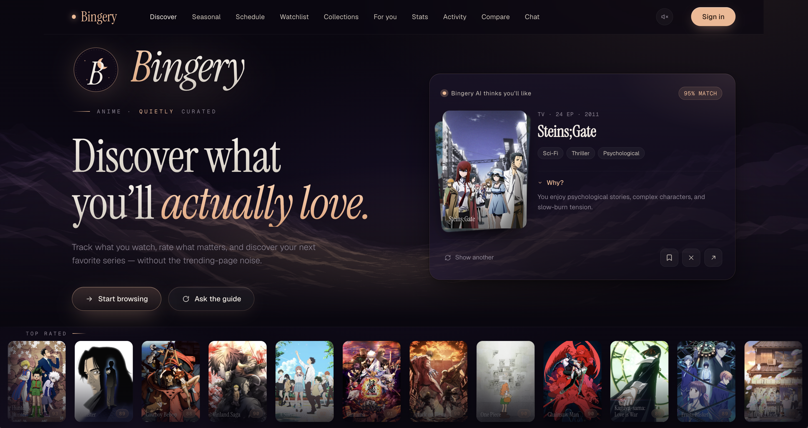
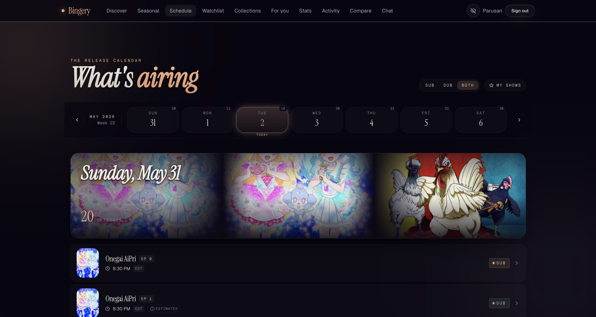
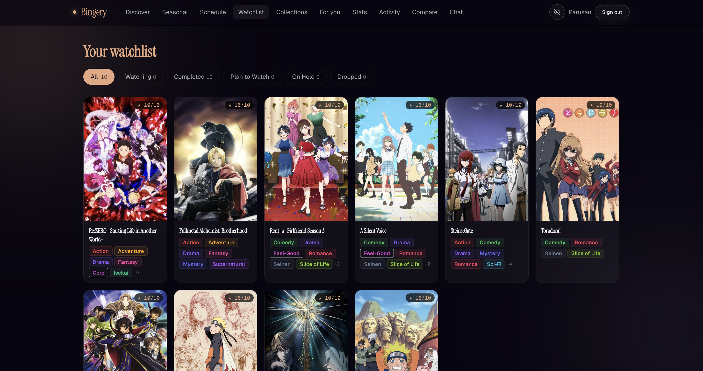
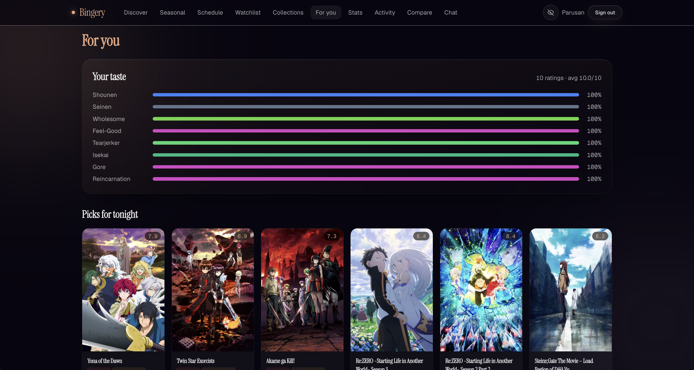
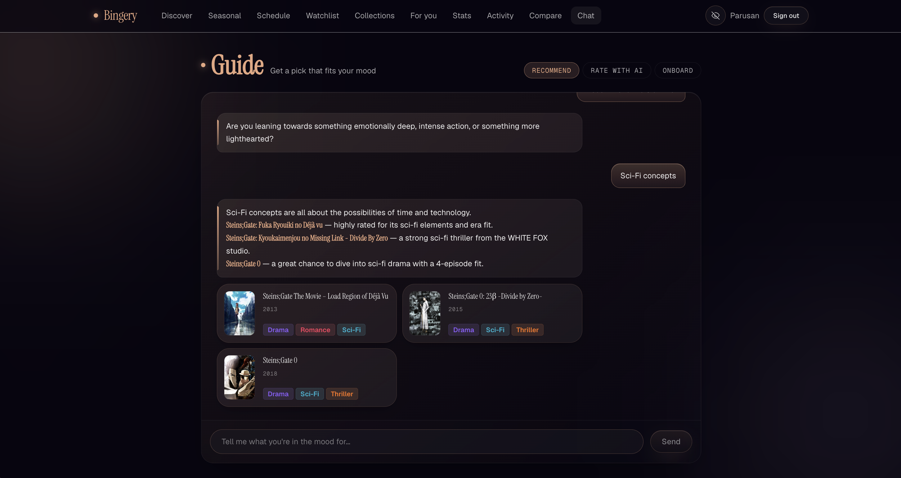
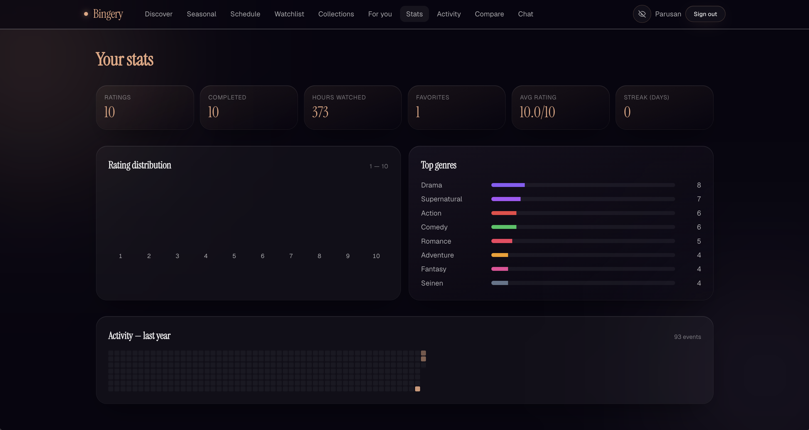
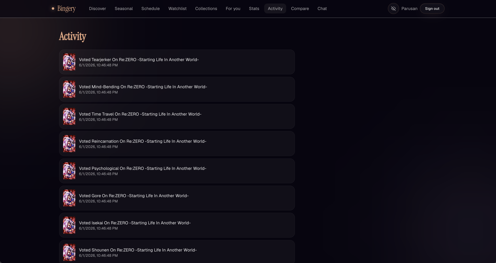
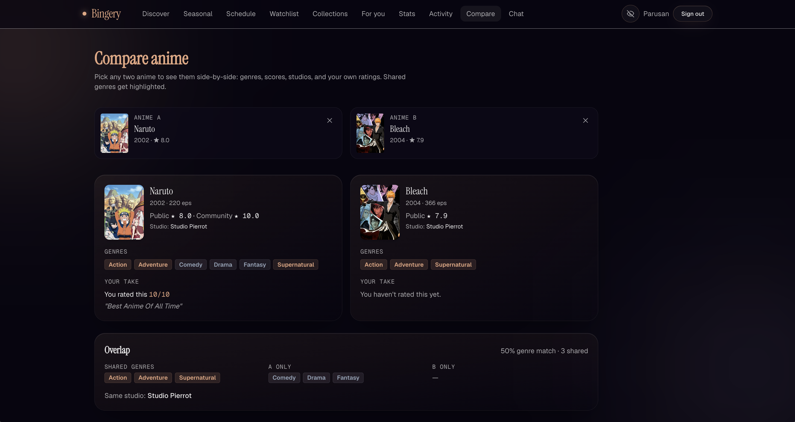
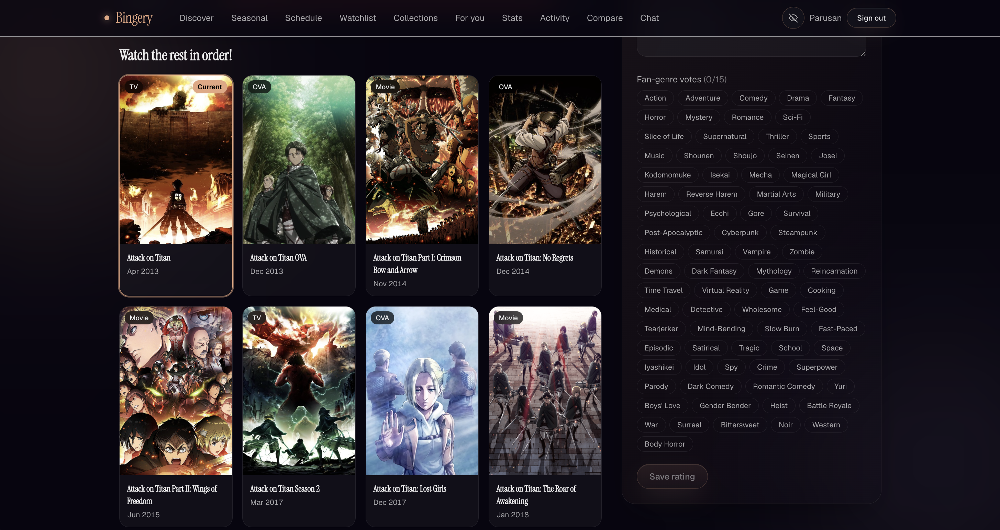
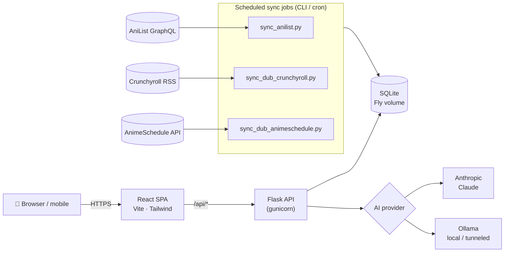

<div align="center">

# 🍿 Bingery

### An anime discovery, tracking & recommendation app — with an AI guide, community fan‑genres, and sub/dub release tracking.

[](https://bingery.fly.dev)


</div>

---

**Bingery** is a full‑stack anime companion. Search a full [AniList](https://anilist.co)‑synced catalog, track what you're watching across **both sub and dub**, get picks from a **conversational AI guide**, vote on community **"fan genres,"** and follow a **weekly airing schedule** — all wrapped in a hand‑crafted, glassmorphic dark UI that's fully responsive down to a phone.

> 🔗 **Live:** **[bingery.fly.dev](https://bingery.fly.dev)** &nbsp;·&nbsp; Try the **Guide** chat, open any title for its **fan‑genres** and **"watch the rest in order"** strip, or check the **Schedule** for this week's sub & dub episodes.

<div align="center">
  
</div>

---

## ✨ Features

### Discover & browse
- **Full catalog** synced from the AniList GraphQL API, with poster grids and rich detail pages.
- **Fuzzy search** with live autocomplete (powered by `rapidfuzz`) and faceted filters.
- **Seasonal** browser for what's airing each season.

### Track everything — sub *and* dub
- **Watchlist** with watch statuses, favorites, and per‑title progress.
- **Airing Schedule**: a weekly view tracking **sub *and* dub** episode releases, a "my shows only" filter, and per‑day jump navigation.
- **Dub sourcing** from multiple feeds (Crunchyroll RSS + AnimeSchedule.net), plus crowd‑sourced **dub reports** with an admin moderation queue.

### Personalize
- **For You** recommendations driven by a **taste profile** and behavioral **rec signals**.
- **Ratings** — score titles and talk a rating through with the AI.
- **Collections** — build custom, shareable lists.

### The AI Guide 🤖
A conversational assistant with three modes:
- **Recommend** — describe a mood, get a curated handful of picks.
- **Rate with AI** — talk through how a show felt and land on a score.
- **Onboard** — build your taste profile in a few questions.

Backed by **pluggable providers** — cloud **Anthropic (Claude)** or a local/tunneled **Ollama** model — with structured **tool‑calling** so the model can search the catalog and act on your library.

### Rich detail pages
- **Community fan‑genres** — vote on the genres that *actually* describe a show.
- **"Watch the rest in order"** — a related‑franchise strip that walks the series chronologically.
- **Similar titles**, a **next‑episode** widget, and a one‑tap **dub report**.

### Insights & social
- **Stats** — an activity heatmap, genre breakdown, rating histogram, and overview cards.
- **Activity** feed and a side‑by‑side **Compare** of any two titles (genres, scores, studios, your ratings).

### Thoughtful touches
- **NSFW toggle** — show/hide Ecchi‑tagged titles (Hentai is always hidden).
- **JWT auth** with a one‑command **demo user**.
- **Fully mobile‑optimized** — native‑feel bottom‑tab navigation, a "More" sheet, and modals that become bottom sheets below 768px, with the desktop experience preserved pixel‑for‑pixel.

---

## 📸 Screenshots

<table>
  <tr>
    <td width="50%" valign="top"><br/><sub><b>Discover</b> — search &amp; browse the AniList-synced catalog</sub></td>
    <td width="50%" valign="top"><br/><sub><b>Schedule</b> — weekly sub &amp; dub episode tracking</sub></td>
  </tr>
  <tr>
    <td valign="top"><br/><sub><b>Watchlist</b> — statuses, favorites &amp; progress</sub></td>
    <td valign="top"><br/><sub><b>For You</b> — taste-driven recommendations</sub></td>
  </tr>
  <tr>
    <td valign="top"><br/><sub><b>Seasonal</b> — browse by airing season</sub></td>
    <td valign="top"><br/><sub><b>AI Guide</b> — recommend, rate &amp; onboard</sub></td>
  </tr>
  <tr>
    <td valign="top"><br/><sub><b>Stats</b> — heatmap, genre breakdown &amp; rating histogram</sub></td>
    <td valign="top"><br/><sub><b>Activity</b> — your recent watch history</sub></td>
  </tr>
  <tr>
    <td valign="top"><br/><sub><b>Compare</b> — two titles side by side</sub></td>
    <td valign="top"><br/><sub><b>Watch in order</b> — the related-franchise strip</sub></td>
  </tr>
</table>

## 🧱 Tech stack

| Layer | Technologies |
| --- | --- |
| **Frontend** | React 18 · TypeScript 5.6 · Vite 5 · Tailwind CSS 3.4 · TanStack Query 5 · Zustand · React Router 6 · Framer Motion · lucide‑react |
| **Backend** | Python 3.13 · Flask 3 · Flask‑SQLAlchemy · Flask‑JWT‑Extended · Flask‑Bcrypt · Flask‑CORS · Marshmallow · RapidFuzz |
| **Data & AI** | AniList GraphQL · Crunchyroll RSS · AnimeSchedule.net API · Anthropic (Claude) · Ollama |
| **Database** | SQLite (SQLAlchemy ORM) on a Fly.io persistent volume |
| **Infra** | Docker (multi‑stage) · Fly.io (region `yyz`) · Gunicorn · GitHub Actions (scheduled syncs) |
| **Testing** | pytest · pytest‑flask · responses (backend) · Vitest · Testing Library · Playwright (frontend) |

---

## 🏗️ Architecture



A single **Flask** application exposes a JSON API under `/api/*` and serves the built **React** SPA. Catalog and release data are kept fresh by **resumable CLI sync jobs** (run on a schedule via GitHub Actions / Render cron). The AI Guide talks to a **provider abstraction** so the same chat works against Claude in the cloud or a local Ollama model. State lives in **SQLite** on a Fly.io persistent volume.

---

## 📂 Project structure

```
bingery/
├── app.py                      # Flask app factory + blueprint registry
├── config.py                   # Env-driven config + production safety guards
├── models.py                   # SQLAlchemy models (Anime, User, Watchlist, …)
├── routes/                     # 16 API blueprints (auth, anime, schedule, chatbot, …)
├── utils/                      # AniList client, dub sources, AI providers, NSFW, tokens
├── tests/                      # pytest suite (301 tests)
│
├── sync_anilist.py             # Resumable AniList catalog sync (CLI)
├── sync_dub_crunchyroll.py     # Dub schedule from Crunchyroll RSS (CLI)
├── sync_dub_animeschedule.py   # Dub schedule from AnimeSchedule.net (CLI)
├── seed.py · seed_demo_user.py # DB bootstrap / curated demo data
├── seed_dub_schedule.py        # Synthetic dub-lag seed (also imported by routes)
├── migrate_watchlist.py        # One-off data migration
│
├── frontend/                   # React + TypeScript + Vite SPA
│   ├── src/
│   │   ├── features/           # discover, details, schedule, watchlist, chat, stats, …
│   │   ├── layout/             # AppShell, Header + mobile chrome (BottomTabBar, MoreSheet…)
│   │   ├── design/             # design system — tokens, GlassCard, Modal, motion
│   │   ├── hooks/ · stores/    # TanStack Query hooks + Zustand stores
│   │   └── routes.tsx
│   └── public/landing.html     # standalone marketing landing page (iframed)
│
├── docs/                       # DEPLOYMENT.md + design specs & implementation plans
├── Dockerfile · fly.toml       # Fly.io deployment (multi-stage build)
├── render.yaml · Procfile      # Render cron workers / process definition
└── .github/workflows/          # scheduled dub-schedule refresh
```

---

## 🚀 Getting started

### Prerequisites
- **Python 3.13+** and **Node.js 20+**
- (Optional) an **Anthropic API key** *or* a running **Ollama** instance for the AI Guide

### 1 · Backend

```bash
# from the repo root
python -m venv .venv && source .venv/bin/activate   # Windows: .venv\Scripts\activate
pip install -r requirements.txt

cp .env.example .env            # then edit values (see Configuration below)
python seed.py                  # bootstrap a fresh dev DB with ~20 curated titles
python app.py                   # dev server → http://localhost:5000
```

> For a richer dev database, run a catalog sync: `python sync_anilist.py --max-pages 5`
> (a full sync is large and takes hours — `--max-pages` caps it for local use).
> Add the curated demo account with `python seed_demo_user.py`.

### 2 · Frontend

```bash
cd frontend
npm install
npm run dev                     # Vite dev server → http://localhost:5173
```

The Vite dev server proxies `/api/*` to the Flask backend, so run both together.

---

## ⚙️ Configuration

All backend config is environment‑driven (`config.py` + `.env`). Key variables:

| Variable | Purpose | Default |
| --- | --- | --- |
| `AI_PROVIDER` | `ollama` or `anthropic` | `ollama` |
| `ANTHROPIC_API_KEY` / `ANTHROPIC_MODEL` | Claude provider | — / `claude-sonnet-4-6` |
| `OLLAMA_BASE_URL` / `OLLAMA_MODEL` | Local/tunneled Ollama provider | `localhost:11434` / `gemma4:e4b` |
| `OLLAMA_CF_ACCESS_CLIENT_ID/SECRET` | Cloudflare Access token for a gated Ollama tunnel | — |
| `DATABASE_URL` | SQLAlchemy connection string | `sqlite:///bingery.db` |
| `SECRET_KEY` / `JWT_SECRET_KEY` | Flask session & JWT signing secrets | `change-me` |
| `CORS_ORIGINS` | Comma‑separated allowed origins for `/api/*` | `*` (dev) |
| `FLASK_ENV` | Set to `production` on deploy | — |
| `ANIMESCHEDULE_API_KEY` | Bearer token for the AnimeSchedule dub sync | — |

> 🔒 **Production safety guards:** when `FLASK_ENV=production`, the app **refuses to boot** with default `change-me` secrets or a wildcard (`*`) CORS origin — misconfiguration fails fast instead of shipping insecure.

---

## 🧪 Testing

```bash
# Backend — 301 tests
python -m pytest -q

# Frontend — type-check, unit/component, e2e
cd frontend
npm run lint          # tsc -b (type-check)
npm run test:run      # Vitest unit/component tests
npm run e2e           # Playwright end-to-end
```

---

## 📡 API overview

The Flask backend exposes JSON under `/api/*`. Blueprints by domain:

| Area | Mount | Area | Mount |
| --- | --- | --- | --- |
| Auth | `/api/auth` | Stats | `/api/stats` |
| Anime & detail | `/api/anime` | Activity | `/api/activity` |
| Search | `/api/search` | Seasonal | `/api/seasonal` |
| Ratings | `/api` | Compare | `/api/compare` |
| Watchlist | `/api/watchlist` | Schedule | `/api` |
| Collections | `/api/collections` | Dub reports | `/api/dub-reports` |
| Recommendations | `/api/recommend` | Admin | `/api/admin` |
| AI Guide (chat) | `/api/chat` | Health | `/api/health` |

Auth is **JWT** (`Flask-JWT-Extended`) with **bcrypt**‑hashed passwords.

---

## 🚢 Deployment

The production app runs on **[Fly.io](https://fly.io)** (region `yyz` / Toronto) from a multi‑stage **Docker** image — the frontend is built with Vite and served by the Flask/gunicorn backend, with **SQLite on a persistent volume**.

```bash
fly deploy                      # build image, release, health-check
fly status -a bingery
curl https://bingery.fly.dev/api/health    # → {"status":"ok"}
```

- **`render.yaml`** defines **Render cron workers** that run the catalog/dub sync jobs on a schedule.
- **`.github/workflows/refresh-schedule.yml`** refreshes the dub schedule via GitHub Actions.
- See **[`docs/DEPLOYMENT.md`](docs/DEPLOYMENT.md)** for the full runbook (including the Ollama‑over‑Cloudflare‑Access tunnel).

---

## 🎨 Design system

A bespoke dark, glassmorphic aesthetic defined by design tokens in `frontend/src/design/tokens.ts`:

- **Palette** — near‑black violet background (`#080510`), warm **amber** accent (`#e6a680`), with peach/gold accents for the schedule.
- **Type** — an elegant serif display (Instrument Serif / Fraunces), clean sans body (Geist / Inter), and a mono for labels (Geist Mono / JetBrains Mono).
- **Surfaces** — translucent `GlassCard`s with layered inset highlights, ambient gradient blobs, a film‑grain overlay, and a WebGL "liquid glass" hero surface.
- **Motion** — Framer Motion springs and eased transitions, with reusable variants and a shared motion vocabulary.
- **Responsive** — Tailwind's default breakpoints; mobile is the unprefixed base and desktop (`md:`+, ≥768px) is preserved exactly.

---

## 🗺️ Roadmap & data sources

Bingery aggregates and credits these open data sources:
- **[AniList](https://anilist.co)** — catalog, metadata, scores (GraphQL API).
- **Crunchyroll** (public release RSS) & **[AnimeSchedule.net](https://animeschedule.net)** — dub release timing.

Design specs and phased implementation plans live under [`docs/superpowers/`](docs/superpowers/) — the project was built feature‑by‑feature with written specs and TDD.

---

## 📄 License

© 2026 Parusann. Personal project — all rights reserved. (No open‑source license is currently granted; add a `LICENSE` file to set redistribution terms.)

<div align="center">

**[▶ Open the live app](https://bingery.fly.dev)**

</div>
